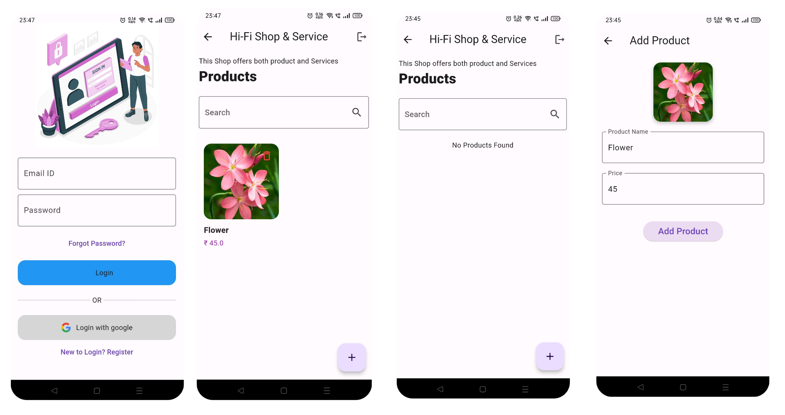

# Add Product

This application is Basic add Product It Uses local storage to save data
It is implemented on feature first clean architecture with bloc as State management

#### Screenshots




## Features

- Local Storage
- state management (Bloc)
- Authenticaion locally 
- Splash screen
- Searching, Deleting

## API Reference

#### Get all items

```http
  GET https://reqres.in/api/login
```


#### Credentials

- **Email:** eve.holt@reqres.in

- **Password:** pistol

